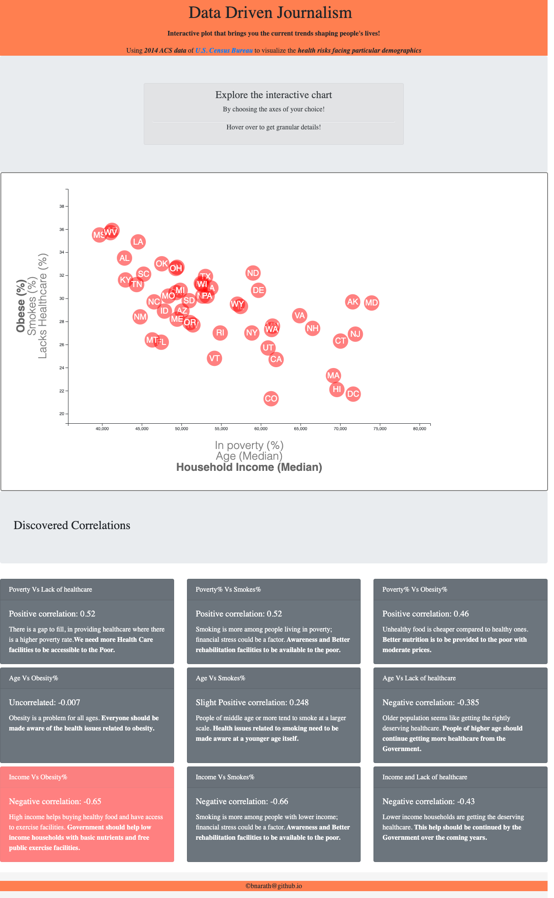

# Data Journalism using D3 visuals!!

  
  
  
Welcome to the newsroom! This project is to analyze the census data to find the current trends shaping people's lives, as well as creating charts, graphs, and interactive elements using [D3.js](https://d3js.org/) to help readers understand the findings. We know how impactful visualization is to tell the underlying story; here we see how that is being done using a powerful tool like `D3`!

In this project, we sift through information from `the U.S. Census Bureau` and the `Behavioral Risk Factor Surveillance System` and visualize the health risks facing particular demographics.
 

## Dataset

The [data set](assets/data/data.csv) is based on 2014 ACS 1-year estimates: [https://data.census.gov/cedsci/](https://factfinder.census.gov/faces/nav/jsf/pages/searchresults.xhtml), The data set includes data on rates of income, obesity, poverty, etc. by state. MOE stands for "margin of error."

- - -

**Javascript library [d3](https://d3js.org/) and [SVG drawings](https://www.w3.org/TR/SVG2/) are used extensively in this project.**

## Website is deployed [here!](https://bnarath.github.io/D3_Data-Journalism)

## Features

### Interactive plot with smooth transition and tooltip for granularity

### Responsive

Special note here; The selected graph doesn't change during window resizing. Special timer function is used to handle this.

### Highlighting the content on correlation based on the selection

## CodeBase
* [app.js](assets/js/app.js)
* [d3Style.css](assets/css/d3Style.css)
* [style.css](assets/css/style.css)
* [index.html](index.html)
* [Python code to find correlations easily, excuse me, I am a python girl!](Find_Correlation_Coefficients.ipynb)

## References

* [d3 documentation](https://d3js.org/)
* [David Gotz's example](https://bl.ocks.org/davegotz/bd54b56723c154d25eedde6504d30ad7)

- - -
